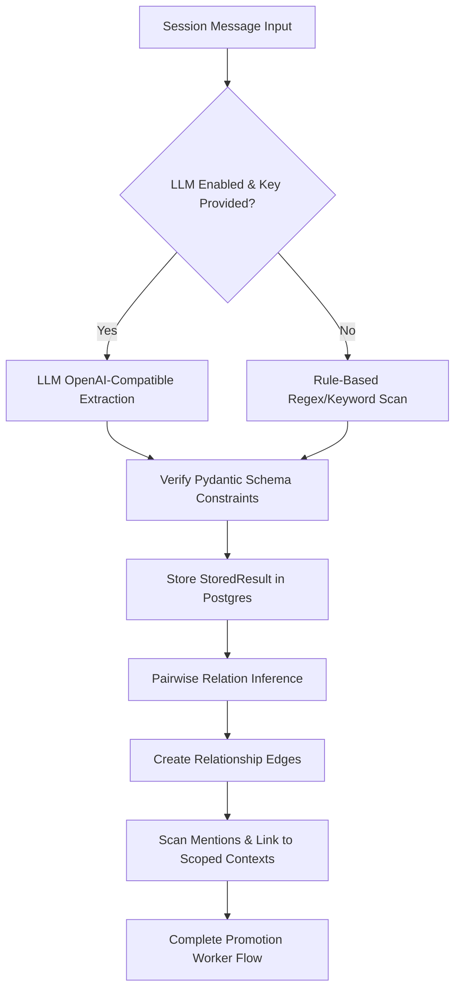

<!--
(a) What this file is: MENO Architecture Blueprint (ARCHITECTURE.md).
(b) What it does: Specifies the system thesis, multi-tiered memory layers, schema decisions log, ranking algorithms, extraction pipelines, graph BFS traversals, and auditing processes.
(c) How it fits into the MENO system: Global design and architecture reference document.
-->

# MENO — System Architecture & Design Blueprint

Persistent intelligence infrastructure for humans, AI agents, codebases, and organizations.

---

## 1. System Thesis

AI systems and modern software applications suffer from a **context-boundary problem**. Large Language Model contexts are transient, expensive, and subject to distractions (loss of instruction following over long message spans). Vector search databases (RAG) lack context relationships and temporal weightings, treating a transient observation from yesterday with the same architectural value as a system decision made last year.

MENO resolves this by creating a **multi-tiered persistent memory ledger** that maps to the human cognitive process of memory consolidation:
1. **Tier 0 (Working Memory)**: Fast, transient session context (short-term conversation details).
2. **Tier 1-2 (Scoped Knowledge)**: Consolidated facts, code patterns, and decisions linked by typed relationships (e.g. `DECISION implements CODE_PATTERN`).
3. **Tier 3 (Persistent Intelligence)**: Summaries, long-term behavior profiles, and cross-context heuristic rules.

### Memory vs. Knowledge vs. Intelligence

| Dimension | Memory (Working Context) | Knowledge (Relational Graph) | Intelligence (Profiles/Summaries) |
|---|---|---|---|
| **Form** | Session messages cache | Typed nodes and relationship edges | Behavioral preferences, summary logs |
| **Volatilty** | High (evicted on session closure) | Low (decayed by type half-life) | None (permanently retained) |
| **Query Latency** | < 5ms (Redis Key-Lookup) | < 50ms (Postgres + pgvector) | < 15ms (Postgres Relational queries) |
| **Consolidation** | Immediate write | Async Worker Extraction / Promotion | Periodic Background Summarization |

---

## 2. Database Schema Decisions Log

The MENO database schema balances relational integrity with semantic vector operations. Here is our design decisions log:

| Decision | Rationale | Trade-offs |
|---|---|---|
| **SQLAlchemy ORM + Alembic** | Standardizes code-first migrations and ensures Postgres compatibility during tests and production. | Adds setup overhead compared to raw SQL queries. |
| **pgvector Cosine Search** | Simplifies database operations by keeping semantic vector indexes and metadata queries inside a single database engine (PostgreSQL). | Slightly slower than dedicated vector engines (Milvus, Qdrant) at huge scale. |
| **Redis Cache Dual-Write** | Keeps current session messages in Redis for sub-millisecond response rates while backing up data to Postgres for crash recovery. | Double-write code complexity; cache invalidation tracking. |
| **UUID Primary Keys** | Prevents ID collisions across distributed agents, clients, and multi-tenant nodes. | Marginally larger indexes and disk consumption. |
| **Cascade Deletes on Sessions** | Ensures deleting a session automatically purges its transient messages, protecting user privacy and preventing orphaned tables. | High-risk cascading operations if session IDs are mishandled. |

---

## 3. Core Algorithms

### 3.1. Type-Aware Ranking Function
MENO implements a type-aware decay function that scales recency based on the category of knowledge retrieved. For instance, code patterns decay faster than core architecture choices.

The final score $S$ is calculated as:

$$S = 0.5 \cdot \text{Similarity} + 0.2 \cdot \text{Recency} + 0.15 \cdot \text{Confidence} + 0.1 \cdot \text{ContextMatch} + 0.05 \cdot \text{AccessCount}$$

Where:
- **Similarity**: Cosine similarity score returned from `pgvector` index search.
- **Recency**: Exponent-based decay calculated via half-life values:
  $$\text{Recency} = e^{-\frac{0.693 \cdot \text{AgeDays}}{\text{HalfLifeDays}}}$$
- **Confidence**: User-assigned confidence level (defaults to 0.5 for automatic rule-based extractions).
- **ContextMatch**: Binary weight (1.0 if object context matches query context; 0.5 otherwise).
- **AccessCount**: Frequency factor bounded to $[0.0, 1.0]$:
  $$\text{AccessCount} = \frac{\min(\text{accesses}, 20)}{20.0}$$

#### Configurable Type-Aware Half-Lives
- `decision` / `architecture`: 180 Days
- `api_spec`: 90 Days
- `code_pattern` / `refactoring`: 60 Days
- `bug_report`: 30 Days
- `memory` (General observation): 7 Days

---

### 3.2. Extraction Pipeline
Knowledge extraction operates in two modes:

1. **Rule-Based Mode (Default)**: Matches messages against keyword lists (e.g. `["decided", "we chose"]` for decisions, `["bug", "error", "fails"]` for bug reports).
2. **LLM-Based Mode**: Sends history to an LLM provider to structure messages into JSON arrays containing keys `type`, `title`, `content`, `confidence`, and `tags`.

---

### 3.3. Relationship Graph BFS
Graph traversals map relationships outwards starting from a root knowledge node. 

The algorithm executes a Breadth-First Search (BFS) bounded by `max_depth` (default=2):
1. **Initialize**: Set `nodes` to contain the root, `edges` as empty, and `visited` list containing the root ID.
2. **Queue**: Seed BFS queue with `(root_id, current_depth=0)`.
3. **Loop**: While the queue is not empty:
   - Dequeue `(current_node_id, depth)`.
   - If `depth >= max_depth`, continue.
   - Fetch all relationships from Postgres where `source_id == current_node_id` or `target_id == current_node_id`.
   - For each relationship, add the opposing node to the queue if not already visited and append the edge to `edges`.
4. **Return**: Subgraph mapping containing `root`, unique `nodes`, and unique `edges`.

---

## 4. Scoping & Isolation

MENO supports scoping isolation via **Context Groups**:
- Contexts are defined by a `context_type` (e.g., `project`, `team`, `organization`) and a `context_id`.
- Every retrieved and stored item can belong to one or more contexts via the `context_ids` link table.
- Scoping ensures that queries executed within `Context A` cannot retrieve or match objects bound exclusively to `Context B`, preventing multi-tenant data leaks and agent confusion.

---

## 5. North Star Roadmap (Years 1-5)

### Year 1: Scaffolding and Core Engines
- Setup PostgreSQL with pgvector, Alembic migrations, and fast Redis working memory caches.
- Implement python client SDK, basic endpoints, and rule-based fallback extractions.
- Run complete test suites.

### Year 2: Multi-Tenancy and MCP Integrations
- Enable multi-tenant sub-database schemas.
- Implement Model Context Protocol (MCP) clients to inject MENO context directly into IDEs.
- Construct visual dashboard graphs.

### Year 3: Advanced Vector Ranking and LLMs
- Train local custom embedding models specialized on source code tokens.
- Hook up context-retrieval loopbacks to LLM agents.
- Automate facts-consolidation from recurring daily tasks.

### Year 4: Self-Cleaning Storage Ledger
- Incorporate automatic conflict resolution when a new decision `supersedes` or `contradicts` an existing decision.
- Build automatic summary engines to clean expired Tier 0 session logs.

### Year 5: Full Organizational Ledger
- Enterprise scale synchronization engines.
- Decentralized cross-context sharing and privacy-preserving filters.

---

## 6. Architecture Audit Checklist (10 Items)

This audit checklist is used during code reviews to maintain repository standards:

1. [ ] **No Raw DB Queries**: All database read/write actions must go through SQLAlchemy model ORM layers or designated wrappers.
2. [ ] **Alembic Synced**: Any schema changes must be accompanied by an Alembic migration script inside `db/migrations/versions`.
3. [ ] **No Raw Strings for Types**: Always use the defined `KnowledgeType` and `RelationshipType` enums inside `core/types.py`.
4. [ ] **File Headers Present**: Every new file contains the 3-part header block (What this file is, What it does, How it fits).
5. [ ] **Dual-Write Integrity**: Ensure writing a message inside a session successfully propagates to both Redis and Postgres.
6. [ ] **Context Scoping Enforced**: Ensure all retrieve queries filter results based on client-provided `context_id` when present.
7. [ ] **Zero API Keys in Code**: All server configurations and API keys must be loaded via `settings` configurations (never hardcoded).
8. [ ] **Test Coverage Maintenance**: Any new endpoints or services must include a passing integration test inside the `tests/` directory.
9. [ ] **Type-Aware Decay Integrity**: Verify ranking scores are correctly calculated using decay half-lives according to the type of retrieved object.
10. [ ] **Graceful LLM Fallbacks**: Ensure that if the LLM extraction provider goes offline, the system safely falls back to rule-based keyword extraction without throwing 500 errors.

## The Delivery Problem and Why MCP
Prompts 1–9 solve the storage half of multi-tool continuity.
Prompts 10–12 solve the delivery half.

Three layers (in priority order):
- **Layer 1 — MCP server (load-bearing)**: Copilot, Claude Code/Desktop, Codex, Antigravity, Cursor, Windsurf all speak MCP natively. One server covers all of them. This layer alone delivers full continuity.
- **Layer 2 — CLI**: `meno init` for setup, `meno ingest` to seed knowledge, `meno capture` for mid-task handoffs, `meno hooks` for git-based automatic capture.
- **Layer 3 — VS Code extension (V2, optional)**: visual graph browser. Not load-bearing.

Why MCP over four separate plugins: the protocol converged. One MCP server is strictly better than four integrations that diverge independently as each tool's API changes.

