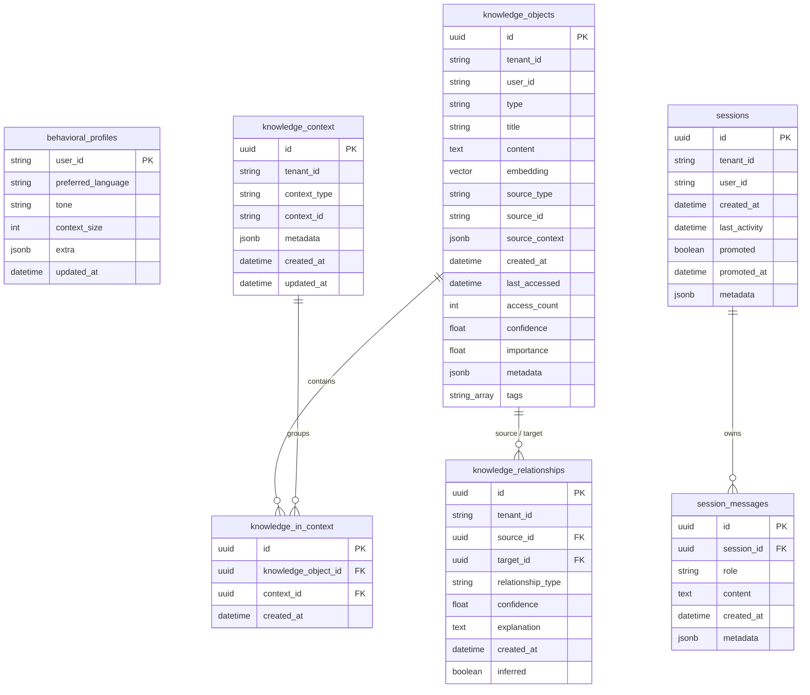
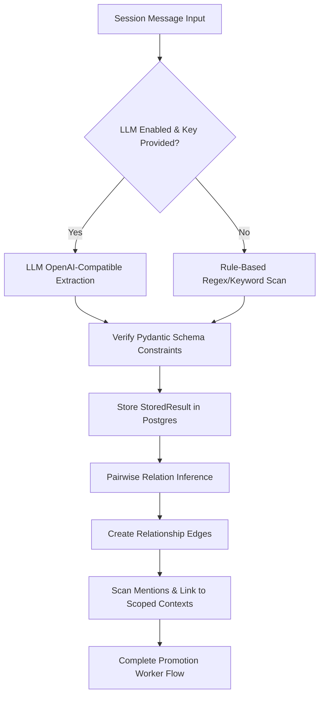

<!--
(a) What this file is: MENO Architecture Blueprint (ARCHITECTURE.md).
(b) What it does: Specifies the system thesis, multi-tiered memory layers, schema decisions log, ranking algorithms, extraction pipelines, graph BFS traversals, and auditing processes.
(c) How it fits into the MENO system: Global design and architecture reference document.
-->

# MENO — System Architecture & Design Blueprint

Persistent intelligence infrastructure for humans, AI agents, codebases, and organizations.

---

## 1. System Thesis

AI systems and modern software applications suffer from a **context-boundary problem**. Large Language Model contexts are transient, expensive, and subject to distractions (loss of instruction following over long message spans). Vector search databases (RAG) lack context relationships and temporal weightings, treating a transient observation from yesterday with the same architectural value as a system decision made last year.

MENO resolves this by creating a **multi-tiered persistent memory ledger** that maps to the human cognitive process of memory consolidation:
1. **Tier 0 (Working Memory)**: Fast, transient session context (short-term conversation details).
2. **Tier 1-2 (Scoped Relational Knowledge)**: Consolidated facts, code patterns, and decisions linked by typed relationships (e.g. `DECISION implements CODE_PATTERN`).
3. **Tier 3 (Persistent Intelligence)**: Summaries, long-term behavior profiles, and cross-context heuristic rules.

### Memory vs. Knowledge vs. Intelligence

| Dimension | Memory (Working Context) | Knowledge (Relational Graph) | Intelligence (Profiles/Summaries) |
| :--- | :--- | :--- | :--- |
| **Form** | Session messages cache | Typed nodes and relationship edges | Behavioral preferences, summary logs |
| **Volatility** | High (evicted on session closure / 24h TTL) | Low (decayed by type-specific half-life) | None (permanently retained) |
| **Query Latency** | < 5ms (Redis Key-Lookup) | < 50ms (Postgres + pgvector) | < 15ms (Postgres Relational queries) |
| **Consolidation** | Immediate write | Async Worker Extraction / Promotion | Periodic Background Summarization |
| **Underlying Tiers** | Tier 0 | Tier 1 & Tier 2 | Tier 3 |

---

## 2. Multi-Tiered Memory Architecture

```
┌─────────────────────────────────────────────────────────────────┐
│  AI Tools & Clients                                             │
│  Copilot · Claude Code · Cursor · Windsurf · Codex · CLI · SDK │
└──────────────────────────┬──────────────────────────────────────┘
                           │  MCP (stdio or HTTP/SSE)
┌──────────────────────────▼──────────────────────────────────────┐
│  apps/mcp  —  9 MCP tools                                      │
│  store · retrieve · relate · graph · session · promote · …     │
└──────────────────────────┬──────────────────────────────────────┘
                           │  internal function calls
┌──────────────────────────▼──────────────────────────────────────┐
│  apps/api  —  FastAPI REST (localhost:8000)                     │
│  /knowledge · /sessions · /context · /worker · /profile        │
└────┬──────────────────────┬──────────────────────────┬──────────┘
     │                      │                          │
┌────▼────────┐   ┌─────────▼──────────┐   ┌──────────▼─────────┐
│  Tier 0     │   │  Tier 1 + 2        │   │  Tier 3            │
│  Redis      │   │  Postgres          │   │  Postgres          │
│  Working    │   │  + pgvector        │   │  Behavioral        │
│  memory     │   │  Knowledge objects │   │  profiles          │
│  < 5ms      │   │  + graph edges     │   │  & preferences     │
│  24h TTL    │   │  cosine + BFS      │   │                    │
└─────────────┘   └────────────────────┘   └────────────────────┘
                           ▲
               ┌────────────┴────────────┐
               │  Promotion worker       │
               │  Session → typed        │
               │  knowledge objects      │
               │  + relationship infer   │
               └─────────────────────────┘
```

### Tier 0: Working Memory (Redis + Postgres Dual-Write)
- **Role**: Caches live, ongoing user-assistant conversation messages.
- **Mechanism**: Every user/assistant interaction is appended to an active Redis-backed list representing the session memory. Concurrently, it is persisted to PostgreSQL to guarantee durability. 
- **Purge/Lifecycle**: Redis entries carry a strict 24-hour Time-to-Live (TTL). When a session is promoted (via `meno_promote_session`), it undergoes structural extraction to long-term memory, and the transient session context is marked as promoted.

### Tier 1: Scoped Semantic Knowledge (PostgreSQL + pgvector)
- **Role**: Durable, search-optimized factual nodes.
- **Mechanism**: Stores text content paired with vector embeddings generated via `BAAI/bge-small-en-v1.5` (a 384-dimensional model). Custom indexing via `ivfflat` utilizing `vector_cosine_ops` allows sub-50ms vector queries.

### Tier 2: Relational Graph (PostgreSQL Foreign Keys)
- **Role**: Explicit structural connections between knowledge nodes.
- **Mechanism**: Defines directional, typed relational edges (e.g., `supersedes`, `implements`, `depends_on`). Walking this graph during retrieval prevents information fragmentation and provides contextual depth.

### Tier 3: Long-term Behavioral Profiles & Preferences
- **Role**: Global personalization layer.
- **Mechanism**: Stores user preferences (e.g., `allow_memory_storage`, custom prompts, context sizes) and automatically built behavioral summaries.

---

## 3. Database Relational Schema

MENO utilizes PostgreSQL (with the `pgvector` extension) as its single source of truth for persistent storage.



### 3.1. `knowledge_objects`
Stores the fundamental pieces of information extracted from source files, commits, or chat sessions.
* **`id`** (`UUID`, Primary Key): Generated using `gen_random_uuid()`.
* **`tenant_id`** (`String`, Indexed): Scopes queries within a specific organizational context.
* **`user_id`** (`String`, Indexed): Links the knowledge item to a specific user.
* **`type`** (`String`): Enforced by check constraint to be one of the `KnowledgeType` enums: `memory`, `code_pattern`, `decision`, `api_spec`, `bug_report`, `refactoring`, `architecture`.
* **`title`** (`String`, Nullable): Concise label representing the knowledge node.
* **`content`** (`Text`): The underlying knowledge string or code block.
* **`embedding`** (`Vector(384)`, Nullable): BAAI/bge-small-en-v1.5 embedding vector. Indexed with `IVFFlat` using cosine operations.
* **`source_type`** / **`source_id`** (`String`, Nullable): Tracks provenance (e.g. `source_type="file"`, `source_id="README.md"`).
* **`source_context`** (`JSONB`): Detailed metadata on where it came from (e.g., lines, commits, authors).
* **`access_count`** (`Integer`): Incremented on every retrieval query to calculate frequency weight.
* **`confidence`** / **`importance`** (`Float`): Ratings bounded between $0.0$ and $1.0$.
* **`metadata`** (`JSONB`): Extensible key-value storage.
* **`tags`** (`ARRAY(Text)`): Indexed using a GIN index to speed up structural tag filtering.

### 3.2. `knowledge_relationships`
Represents directed edges between knowledge objects in the relational graph.
* **`source_id`** (`UUID`, Foreign Key pointing to `knowledge_objects.id` on delete CASCADE).
* **`target_id`** (`UUID`, Foreign Key pointing to `knowledge_objects.id` on delete CASCADE).
* **`relationship_type`** (`String`): Enforced by check constraint to be one of: `supersedes`, `implements`, `depends_on`, `related_to`, `contradicts`, `extends`, `is_instance_of`, `mentioned_in`.
* **`confidence`** (`Float`): Confidence score of the relationship ($0.0$ to $1.0$).
* **`explanation`** (`Text`, Nullable): Reasoning behind linking the two objects.
* **`inferred`** (`Boolean`): Marked `true` if established automatically by the promotion worker.

### 3.3. `knowledge_context` & `knowledge_in_context`
Enforces isolation by grouping knowledge objects under contexts like `project`, `team`, `organization`, or `codebase`.
* **`uq_context_tenant_type_id`** constraint prevents duplicate context declarations.
* **`knowledge_in_context`** links objects to contexts with cascade delete behaviors.

### 3.4. `sessions` & `session_messages`
Stores the Tier 0 active message threads. Messages role checking constraints only allow `'user'`, `'assistant'`, or `'system'`.

---

## 4. Core Algorithms

### 4.1. Type-Aware Ranking Function

When a retrieval query is executed, MENO scores matching database entries using a multi-dimensional ranking algorithm:

$$S = 0.5 \cdot \text{Similarity} + 0.2 \cdot \text{Recency} + 0.15 \cdot \text{Confidence} + 0.1 \cdot \text{ContextMatch} + 0.05 \cdot \text{AccessCount}$$

#### Term Breakdowns:
1. **Similarity**: Cosine distance mapping ($1.0 - \text{distance}$) from pgvector.
2. **Recency**: Uses exponential decay based on the type-specific half-life:
   $$\text{Recency} = e^{-\frac{\ln(2) \cdot \text{AgeDays}}{\text{HalfLifeDays}}}$$
   - **`decision` / `architecture`**: $180$ days half-life (persists longer).
   - **`api_spec`**: $90$ days half-life.
   - **`code_pattern` / `refactoring`**: $60$ days half-life.
   - **`bug_report`**: $30$ days half-life.
   - **`memory`**: $7$ days half-life (decays rapidly).
3. **Confidence**: Value assigned at ingestion/extraction ($0.0 - 1.0$).
4. **ContextMatch**: $1.0$ if the object is assigned to the current query context, otherwise $0.5$.
5. **AccessCount**: Frequency amplification:
   $$\text{AccessCount} = \frac{\min(\text{accesses}, 20)}{20.0}$$

---

### 4.2. Extraction & Promotion Pipeline

Every $N$ turns, or when the user calls `meno_promote_session`, the session is processed to extract structured knowledge:



- **Rule-Based Extraction**: Scans the text using regex mappings. If a message contains words like `"decided"`, `"we chose"`, or `"decision:"`, it is extracted as a `decision`. If no keywords match but the message is $>20$ characters, it is stored as a default `memory`.
- **LLM Extraction**: Hits the `/chat/completions` endpoint of the configured model. System prompt forces outputting a Pydantic-validated JSON array of extracted knowledge models.
- **Relationship Inference**: Pairwise check runs on the extracted list. If a `decision` and `code_pattern` are identified together, a relationship edge of type `implements` (confidence: $0.7$) is established automatically.

---

### 4.3. Relationship Graph BFS

Retrieved items can be expanded by traversing relationships to pull in adjacent nodes (e.g. fetching the `bug_report` that contradicts a retrieved `decision`):

```
Algorithm 1: Subgraph Retrieve BFS
Input: root_id, max_depth, relationship_types_filter
Output: unique_nodes, unique_edges

1:  visited_ids ← {root_id}
2:  queue ← Queue()
3:  queue.push((root_id, current_depth=0))
4:  nodes ← []
5:  edges ← []
6:  while queue is not empty do
7:      (current_id, depth) ← queue.pop()
8:      if depth >= max_depth then
9:          continue
10:     end if
11:     relations ← QueryDB(source_id = current_id OR target_id = current_id)
12:     for each rel in relations matching relationship_types_filter do
13:         opposing_id ← (rel.source_id == current_id) ? rel.target_id : rel.source_id
14:         if opposing_id ∉ visited_ids then
15:             visited_ids.add(opposing_id)
16:             node ← FetchKnowledgeObject(opposing_id)
17:             nodes.add(node)
18:             queue.push((opposing_id, depth + 1))
19:         end if
20:         edges.add(rel)
21:     end for
22: end while
23: Return (nodes, edges)
```

---

## 5. Scoping & Isolation (Context Groups)

MENO supports scoping isolation via **Context Groups**:
* Contexts are defined by a `context_type` (e.g., `project`, `team`, `organization`, `codebase`) and a `context_id` string.
* Every retrieved and stored item can belong to one or more contexts via the `knowledge_in_context` link table.
* Scoping ensures that queries executed within `Context A` cannot retrieve or match objects bound exclusively to `Context B`, preventing multi-tenant data leaks and agent confusion.

---

## 6. The Model Context Protocol (MCP) Delivery Layer

MENO uses the Model Context Protocol (MCP) as its primary tool-delivery mechanism, providing an abstraction layer over IDE integrations.

```
┌─────────────────────────────────────────────────────────────┐
│                      MCP Clients                            │
│   (Claude Code, VS Code, Cursor, Windsurf, Antigravity)     │
└──────────────────────────────┬──────────────────────────────┘
                               │
               ┌───────────────▼───────────────┐
               │    MENO MCP Server (apps/mcp) │
               └───────────────┬───────────────┘
                               │
            ┌──────────────────┼──────────────────┐
            │                  │                  │
    ┌───────▼──────┐   ┌───────▼──────┐   ┌───────▼──────┐
    │  Stdio Tool  │   │  SSE/HTTP    │   │  FastAPI     │
    │  Transport   │   │  Transport   │   │  REST Core   │
    └──────────────┘   └──────────────┘   └──────────────┘
```

The MCP server exposes **9 standard tools** directly to agents:

### 1. `meno_store`
* **Purpose**: Persist a structured piece of knowledge.
* **Payload**:
  ```json
  {
    "tenant_id": "string",
    "user_id": "string",
    "type": "memory|code_pattern|decision|api_spec|bug_report|refactoring|architecture",
    "content": "string",
    "title": "string (optional)",
    "source_type": "string (default: 'conversation')",
    "confidence": 0.5,
    "tags": ["string"],
    "context_ids": ["string"]
  }
  ```

### 2. `meno_retrieve`
* **Purpose**: Query semantic memory for relevant entries.
* **Payload**:
  ```json
  {
    "tenant_id": "string",
    "user_id": "string",
    "query": "string",
    "top_k": 5,
    "knowledge_type": "string (optional)",
    "context_id": "string (optional)",
    "expand_relationships": false
  }
  ```

### 3. `meno_relate`
* **Purpose**: Add a link between two knowledge nodes.
* **Payload**:
  ```json
  {
    "tenant_id": "string",
    "source_id": "string (UUID)",
    "target_id": "string (UUID)",
    "relationship_type": "supersedes|implements|depends_on|related_to|contradicts|extends|is_instance_of|mentioned_in",
    "confidence": 1.0,
    "explanation": "string (optional)"
  }
  ```

### 4. `meno_get_graph`
* **Purpose**: Retrieve the subgraph surrounding an object.
* **Payload**:
  ```json
  {
    "object_id": "string (UUID)",
    "max_depth": 2,
    "relationship_types": ["string"]
  }
  ```

### 5. `meno_search_by_type`
* **Purpose**: Retrieve all knowledge objects of a particular category.
* **Payload**:
  ```json
  {
    "tenant_id": "string",
    "user_id": "string",
    "type": "string",
    "context_id": "string (optional)",
    "limit": 50
  }
  ```

### 6. `meno_define_context`
* **Purpose**: Declare a logical boundary (like a specific repository/project).
* **Payload**:
  ```json
  {
    "tenant_id": "string",
    "context_type": "project|team|organization|codebase",
    "context_id": "string",
    "metadata": {}
  }
  ```

### 7. `meno_create_session`
* **Purpose**: Start an active conversation thread (Tier 0).
* **Payload**:
  ```json
  {
    "tenant_id": "string",
    "user_id": "string"
  }
  ```

### 8. `meno_append_message`
* **Purpose**: Record a message in the active session.
* **Payload**:
  ```json
  {
    "session_id": "string (UUID)",
    "role": "user|assistant|system",
    "content": "string"
  }
  ```

### 9. `meno_promote_session`
* **Purpose**: Run the extraction pipeline on a session to compile it into long-term nodes.
* **Payload**:
  ```json
  {
    "session_id": "string (UUID)"
  }
  ```

---

## 7. North Star Roadmap (Years 1-5)

### Year 1: Scaffolding and Core Engines
* Setup PostgreSQL with pgvector, Alembic migrations, and fast Redis working memory caches.
* Implement python client SDK, basic endpoints, and rule-based fallback extractions.
* Run complete test suites.

### Year 2: Multi-Tenancy and MCP Integrations
* Enable multi-tenant sub-database schemas.
* Implement Model Context Protocol (MCP) clients to inject MENO context directly into IDEs.
* Construct visual dashboard graphs.

### Year 3: Advanced Vector Ranking and LLMs
* Train local custom embedding models specialized on source code tokens.
* Hook up context-retrieval loopbacks to LLM agents.
* Automate facts-consolidation from recurring daily tasks.

### Year 4: Self-Cleaning Storage Ledger
* Incorporate automatic conflict resolution when a new decision `supersedes` or `contradicts` an existing decision.
* Build automatic summary engines to clean expired Tier 0 session logs.

### Year 5: Full Organizational Ledger
* Enterprise scale synchronization engines.
* Decentralized cross-context sharing and privacy-preserving filters.

---

## 8. Architecture Audit Checklist (10 Items)

This audit checklist is used during code reviews to maintain repository standards:

1. [ ] **No Raw DB Queries**: All database read/write actions must go through SQLAlchemy model ORM layers or designated wrappers.
2. [ ] **Alembic Synced**: Any schema changes must be accompanied by an Alembic migration script inside `db/migrations/versions`.
3. [ ] **No Raw Strings for Types**: Always use the defined `KnowledgeType` and `RelationshipType` enums inside `core/types.py`.
4. [ ] **File Headers Present**: Every new file contains the 3-part header block (What this file is, What it does, How it fits).
5. [ ] **Dual-Write Integrity**: Ensure writing a message inside a session successfully propagates to both Redis and Postgres.
6. [ ] **Context Scoping Enforced**: Ensure all retrieve queries filter results based on client-provided `context_id` when present.
7. [ ] **Zero API Keys in Code**: All server configurations and API keys must be loaded via `settings` configurations (never hardcoded).
8. [ ] **Test Coverage Maintenance**: Any new endpoints or services must include a passing integration test inside the `tests/` directory.
9. [ ] **Type-Aware Decay Integrity**: Verify ranking scores are correctly calculated using decay half-lives according to the type of retrieved object.
10. [ ] **Graceful LLM Fallbacks**: Ensure that if the LLM extraction provider goes offline, the system safely falls back to rule-based keyword extraction without throwing 500 errors.
