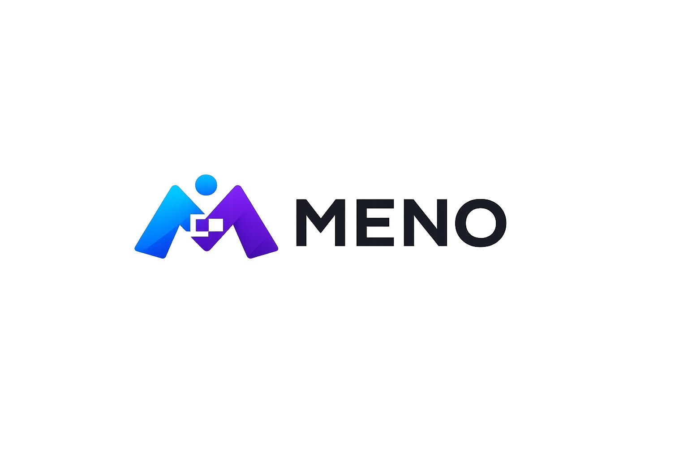

# MENO — Persistent Intelligence Platform

> **The context-boundary problem, solved.** AI coding tools forget everything when you switch tabs, run out of credits, or close the IDE. MENO is a knowledge layer that sits underneath any AI tool and remembers — so decisions made in Copilot are retrievable in Claude Code without re-explaining anything.

---

## The Problem

Every AI coding session starts from zero. You made an important architecture decision last Tuesday in Cursor. Today you're in Claude Code. You explain it again. Next week you're in Copilot. You explain it again. At team scale, this is worse — critical knowledge lives inside individual chat histories that no one else can see.

Traditional RAG approaches don't fix this. They treat a throwaway observation from yesterday with the same weight as a core architectural decision made six months ago.

## What MENO Does Differently

MENO structures knowledge into **typed objects with semantic identity, half-life decay ranking, and a relationship graph** — then delivers it to every MCP-compatible AI tool through a single server.

```
Store a decision in Copilot.
Close VS Code.
Open Claude Code.
Retrieve the decision — no paste, no re-explanation.
```

| What other tools do                         | What MENO does                                                                   |
| ------------------------------------------- | -------------------------------------------------------------------------------- |
| Flat chat history, gone on session end      | Typed knowledge objects, persisted permanently                                   |
| Generic vector embeddings, no relationships | Relationship graph: `DECISION implements CODE_PATTERN`                           |
| All knowledge treated equally               | Half-life decay: architecture lives 180 days, bug reports 30 days                |
| One tool, one silo                          | One MCP server covers Copilot, Claude Code, Cursor, Windsurf, Codex, Antigravity |

---

## Architecture

MENO is structured around four memory tiers that mirror how human cognition actually consolidates knowledge.

```
┌─────────────────────────────────────────────────────────────────┐
│  AI Tools & Clients                                             │
│  Copilot · Claude Code · Cursor · Windsurf · Codex · CLI · SDK │
└──────────────────────────┬──────────────────────────────────────┘
                           │  MCP (stdio or HTTP)
┌──────────────────────────▼──────────────────────────────────────┐
│  apps/mcp  —  9 MCP tools                                      │
│  store · retrieve · relate · graph · session · promote · …     │
└──────────────────────────┬──────────────────────────────────────┘
                           │  internal function calls
┌──────────────────────────▼──────────────────────────────────────┐
│  apps/api  —  FastAPI REST (localhost:8000)                     │
│  /knowledge · /sessions · /context · /worker · /profile        │
└────┬──────────────────────┬──────────────────────────┬──────────┘
     │                      │                          │
┌────▼────────┐   ┌─────────▼──────────┐   ┌──────────▼─────────┐
│  Tier 0     │   │  Tier 1 + 2        │   │  Tier 3            │
│  Redis      │   │  Postgres          │   │  Postgres          │
│  Working    │   │  + pgvector        │   │  Behavioral        │
│  memory     │   │  Knowledge objects │   │  profiles          │
│  < 5ms      │   │  + graph edges     │   │  & preferences     │
│  24h TTL    │   │  cosine + BFS      │   │                    │
└─────────────┘   └────────────────────┘   └────────────────────┘
                           ▲
              ┌────────────┴────────────┐
              │  Promotion worker       │
              │  Session → typed        │
              │  knowledge objects      │
              │  + relationship infer   │
              └─────────────────────────┘
```

### Knowledge types and how they age

Not all knowledge is equally durable. A bug fix from last month is likely irrelevant. An architectural decision from six months ago still governs today's code.

| Type                           | Example                                                 | Half-life |
| ------------------------------ | ------------------------------------------------------- | --------- |
| `decision` / `architecture`    | "We chose SQLite over Postgres for embedded deployment" | 180 days  |
| `api_spec`                     | "Auth header format: Bearer + JWT"                      | 90 days   |
| `code_pattern` / `refactoring` | "Batch Postgres inserts in chunks of 500"               | 60 days   |
| `bug_report`                   | "Connection pool exhaustion under high concurrency"     | 30 days   |
| `memory`                       | General conversation observations                       | 7 days    |

The ranking formula weighs semantic similarity (50%), recency with type-aware decay (20%), confidence (15%), context match (10%), and access frequency (5%).

### Relationship graph

Knowledge objects link to each other with typed edges:

```
DECISION ──[implements]──▶ CODE_PATTERN
BUG_REPORT ──[contradicts]──▶ ARCHITECTURE
CODE_PATTERN ──[extends]──▶ CODE_PATTERN
DECISION ──[supersedes]──▶ DECISION
```

Starting from any node, BFS traversal walks the graph outward (default depth 2) to surface related context automatically during retrieval.

---

## Current State

MENO is a **working local-first prototype**. Everything described here is built and tested.

- ✅ FastAPI backend with 20+ REST endpoints
- ✅ pgvector semantic search with type-aware re-ranking
- ✅ Relationship graph with BFS traversal and automatic inference
- ✅ Redis working memory with Postgres persistence and dual-write
- ✅ Promotion pipeline: session → typed extraction → relationship linking
- ✅ MCP server with 9 tools covering all major AI coding IDEs
- ✅ CLI: `meno init`, `meno ingest`, `meno capture`, `meno hooks`, `meno status`
- ✅ Python SDK (sync + async)
- ✅ 30 passing integration tests across 7 test files
- ✅ Auth middleware, behavioral profiles, context scoping

**What it is not yet:** a hosted service. No public URL exists. Anyone trying it out runs it locally via Docker. See [Trying It Out](#trying-it-out) for the full picture.

---

## Trying It Out

### What you need

- Docker Desktop running
- Python 3.12+
- A project that uses at least one MCP-compatible AI tool (Copilot, Claude Code, Cursor, Windsurf, or Codex)

### Setup (one time, ~2 minutes)

```bash
git clone https://github.com/aakash-kr-7/meno.git
cd meno
cp .env.example .env

pip install meno-cli
meno init
```

`meno init` does four things automatically:

1. Runs `docker compose up --build` to start Postgres (with pgvector), Redis, and the FastAPI server
2. Polls `localhost:8000/health` until it returns 200
3. Scans your project for installed AI tools
4. Writes the MCP configuration file for each detected tool

### Seed your project's existing knowledge

Before your first session, seed MENO with your existing docs so retrieval is useful from day one:

```bash
meno ingest .
```

This walks your codebase, reads READMEs, architecture docs (`ARCHITECTURE.md`, `docs/decisions/`, ADR files), and code with meaningful docstrings, then stores them as typed knowledge objects. You'll see a live count as it runs.

### Use it in your IDE

Your AI tool now has access to MENO's MCP tools. Well-behaved agents (following `AGENTS.md`) will automatically:

- Call `meno_retrieve` before any non-trivial task
- Call `meno_store` after decisions, bug fixes, or code pattern discoveries
- Call `meno_promote_session` before ending a long session or switching tools

If your tool doesn't call these automatically, you can prompt it explicitly:

```
Check MENO for any existing decisions about database schema before we start.
```

```
Store this decision in MENO: we're using Redis for session queuing to throttle concurrent DB connections.
```

### Python SDK

```python
from meno import Meno, KnowledgeType, RelationshipType

sdk = Meno(base_url="http://localhost:8000")

# Store a decision
ctx = sdk.define_context("project", "my_project")
decision = sdk.store(
    user_id="you",
    content="We chose pgvector because it runs inside Postgres, avoiding a separate vector DB.",
    type=KnowledgeType.DECISION,
    context_ids=[ctx.id]
)

# Retrieve semantically
results = sdk.retrieve(
    user_id="you",
    query="why are we using postgres for vector search?",
    context_id=ctx.id,
    expand_relationships=True
)
print(results[0].content)
```

### Capture a conversation manually

If you had a useful session in another tool and want to extract knowledge from it:

```bash
# Paste a conversation and pipe it in
echo "User: We decided to use tokio for async. Assistant: Good call, tokio is the standard." | meno capture
```

### Git hook (automatic capture on commit)

```bash
meno hooks install
```

Every commit thereafter: the post-commit hook reads the commit message and diff, extracts typed knowledge (decisions, bug fixes, refactorings), and stores them in MENO. Exits 0 no matter what — never blocks a commit.

---

## Known Limitations

**These are real. Be aware of them.**

**Docker must be running.** MENO is entirely local. If Docker is down, the API is down, MCP tools fail silently, and your AI tool just works without persistence. Nothing crashes — knowledge just stops being saved. You need to run `docker compose up -d` after every machine restart. A startup script or Docker Desktop's "start on login" setting helps.

**AI tools don't always call the MCP tools unprompted.** `AGENTS.md` is a nudge, not enforcement. Some tools follow it well; others ignore it. You may need to explicitly tell the AI to check MENO, especially for the first few sessions until you develop a feel for your tool's behavior.

**Knowledge compounds over time.** Day one retrieval returns little because little has been stored. The value builds across sessions. Use `meno ingest .` first to bootstrap, then let sessions promote naturally.

**No public hosting.** There's no `try.meno.dev`. To share this with someone, they either clone and run locally, or you deploy to Railway/Render/Fly.io first. See [Team Deployment](#team-deployment) below.

**The extraction pipeline is rule-based by default.** LLM-based extraction (more accurate classification) requires setting `LLM_EXTRACTION_ENABLED=true` and an `LLM_API_KEY` in `.env`. The rule-based mode is intentional — it works offline, zero cost, zero latency — but it's less precise.

---

## Team Deployment

To give a teammate a one-command setup without them running Docker themselves:

**1. Deploy to Railway (recommended)**

Create a Railway project. Add:

- A Postgres service (enable the pgvector plugin)
- A Redis service
- A Web service pointed at this repo, with `docker compose` or the Dockerfile directly

Set these environment variables in Railway:

```
DATABASE_URL=postgresql+asyncpg://...  (from Railway Postgres)
REDIS_URL=redis://...                  (from Railway Redis)
SECRET_KEY=your_secret_key_here
APP_ENV=production
```

**2. Each teammate runs one command**

```bash
pip install meno-cli
meno init --remote https://your-project.railway.app --api-key your_secret_key_here
```

That's it. Their IDEs get configured automatically, pointing at your shared Railway instance. Knowledge stored by one person is immediately retrievable by everyone on the team.

---

## Running Tests

Ensure Docker is running first, then:

```bash
pytest tests/ -v
```

All 30 tests should pass. Test files cover: auth middleware, knowledge extraction, knowledge store/retrieval, MCP server tools, ranking correctness, SDK integration, session management, and cross-process continuity.

---

## Project Structure

```
meno/
├── apps/
│   ├── api/                    # FastAPI app — routes, schemas, middleware
│   │   ├── middleware/auth.py  # X-API-Key enforcement
│   │   ├── routes/             # knowledge, sessions, context, worker, profiles
│   │   └── main.py             # App factory, lifespan, CORS
│   ├── mcp/                    # MCP server — 9 tools, stdio + HTTP transport
│   └── worker/                 # Promotion worker
├── cli/meno_cli/               # meno CLI (init, ingest, capture, hooks, status)
├── core/
│   ├── config.py               # Pydantic Settings — single source of truth
│   ├── embeddings.py           # BAAI/bge-small-en-v1.5 singleton
│   ├── ranking.py              # Type-aware half-life decay scoring
│   ├── llm.py                  # Rule-based + LLM extraction engine
│   └── types.py                # KnowledgeType, RelationshipType, ContextType enums
├── db/
│   ├── models/                 # SQLAlchemy ORM: knowledge objects, relationships,
│   │   │                       # contexts, sessions, behavioral profiles
│   └── migrations/             # Alembic versions
├── knowledge/
│   ├── store.py                # Write path — embed + insert + link contexts
│   ├── retrieval.py            # Cosine search → re-ranking → relationship expansion
│   ├── relationships.py        # Graph edges, BFS traversal
│   ├── context.py              # Context scoping (project / team / org)
│   └── extraction.py          # Session promotion pipeline
├── memory/working/
│   └── redis_store.py          # Tier 0 working memory
├── sdk/python/                 # Python SDK (sync + async, Pydantic models)
├── mcp_clients/                # Config snippets for each supported IDE
├── examples/
│   ├── demo_knowledge.py       # Full 6-phase SDK walkthrough
│   └── demo_continuity.py      # Cross-process continuity proof
└── tests/                      # 30 integration tests
```

---

## Supported Tools

| Tool                   | Transport | Config location                        |
| ---------------------- | --------- | -------------------------------------- |
| VS Code / Copilot Chat | stdio     | `.vscode/mcp.json`                     |
| Claude Code            | stdio     | `claude mcp add`                       |
| Claude Desktop         | stdio     | `claude_desktop_config.json`           |
| OpenAI Codex CLI/IDE   | stdio     | `.codex/config.toml`                   |
| Google Antigravity     | stdio     | `.gemini/antigravity*/mcp_config.json` |
| Cursor                 | stdio     | `.cursor/mcp.json`                     |
| Windsurf               | stdio     | `.windsurf/mcp.json`                   |
| Any tool (team)        | HTTP/SSE  | remote URL + `X-API-Key` header        |

`meno init` writes all of these automatically for whichever tools it detects in your project.

---

## Roadmap

This repository is a working prototype. The next version is a separate project aimed at production-grade, multi-tenant deployment.

**Planned for v2:**

- Multi-tenant database partitioning with row-level isolation
- Custom embedding models trained on source code tokens
- Autonomous conflict resolution (new decision `supersedes` old one automatically)
- Visual knowledge graph browser (VS Code extension)
- Automatic memory compaction: expired Tier 0 logs summarized before deletion
- Full organizational ledger with cross-context routing and privacy filters

---

## Contributing

See [CONTRIBUTING.md](CONTRIBUTING.md) for developer setup, coding standards (header comments on every file, enum usage, no raw SQL), and the PR checklist.

**Three rules that apply to every file in this repo:**

1. Every file starts with a 3-part header comment: what it is, what it does, how it fits
2. No placeholders — all code is real and runnable
3. Always use enums from `core/types.py`, never inline strings

---

## License

MIT — see [LICENSE](LICENSE).

---

_MENO: from the Greek μένω — "to remain, to persist, to endure."_
